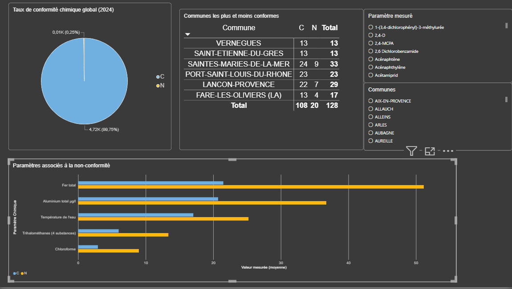

# Analyse de la qualité de l'eau potable: Bouches-du-Rhône (2024)

Projet d'analyse de données appliqué à un sujet environnemental et local : la qualité de l'eau distribuée aux habitants des Bouches-du-Rhône en 2024, à partir des données officielles du contrôle sanitaire.

## Pourquoi ce projet

L'eau potable est un besoin vital, et sa conformité concerne directement chaque habitant d'une commune. J'ai choisi ce sujet pour deux raisons : mon intérêt pour l'environnement, et l'envie d'appliquer mes compétences en chimiométrie (acquises lors d'un stage au CNRS-IMBE) à un cas concret et local, à l'échelle de ma région.

## Problématique

Quels facteurs (paramètres physico-chimiques, zones géographiques) sont le plus souvent associés à la non-conformité de l'eau distribuée dans les Bouches-du-Rhône en 2024 ?

## Source des données

- Base SISE-Eaux (Ministère chargé de la Santé), diffusée sur data.gouv.fr
- Périmètre : département 013 (Bouches-du-Rhône), année 2024
- Deux fichiers utilisés :
  - `DIS_PLV_2024_013.txt`: un prélèvement par ligne (commune, date, verdicts de conformité)
  - `DIS_RESULT_2024_013.txt`:  un paramètre mesuré par ligne, plusieurs lignes par prélèvement
- Lien entre les deux fichiers : le champ `referenceprel`

## Méthodologie

- Nettoyage de PLV : suppression des colonnes inexploitées (peu remplies et hors périmètre de l'analyse), vérification du typage des dates
- Nettoyage de RESULT : suppression de colonnes non exploitables (`limitequal`, vide à 100% sur ce périmètre), suppression des lignes sans valeur mesurée
- Déduplication de PLV sur `referenceprel` : certains prélèvements étaient rattachés à plusieurs réseaux de distribution différents, ce qui créait des doublons avant fusion
- Fusion PLV + RESULT sur `referenceprel`
- Choix méthodologique important : les seuils réglementaires stricts (`plvconformitechimique`) ne sont dépassés que sur 12 prélèvements sur 4 727 (0,25%) un échantillon trop faible pour une analyse statistique robuste. L'analyse approfondie s'appuie donc sur les références de qualité (`plvconformitereferencechim`, 536 cas non conformes), un indicateur moins critique sur le plan sanitaire mais avec une base statistique exploitable

## Résultats clés

- Taux de conformité aux limites de qualité (seuils sanitaires stricts) : 99,75%
- Paramètres les plus associés à la non-conformité aux références de qualité : fer total, aluminium, CO2 libre, trihalométhanes et chloroforme (ces deux derniers étant des sous-produits de désinfection, cohérents avec une température de l'eau également plus élevée dans les prélèvements non conformes)
- Communes les moins conformes sur ce périmètre (effectif minimum de 10 prélèvements) : Saintes-Maries-de-la-Mer, Lançon-Provence, La Fare-les-Oliviers
- Communes à 100% de conformité sur la même période : Saint-Étienne-du-Grès, Port-Saint-Louis-du-Rhône, Vernègues

## Limites de l'analyse

- L'analyse détaillée par paramètre repose sur les références de qualité, pas sur les seuils sanitaires stricts (trop peu de cas pour ces derniers) — à ne pas confondre avec un problème de sécurité sanitaire
- La commune associée à chaque prélèvement est la commune principale du réseau de distribution ; les communes secondaires desservies par un même réseau (environ 9% des réseaux du département) ne sont pas comptabilisées séparément
- Les résultats montrent des corrélations, pas des relations de cause à effet démontrées
- Analyse limitée à une seule année et à un seul département

## Outils utilisés

Python (pandas), Google Colab, Power BI, Git/GitHub

## Dashboard

